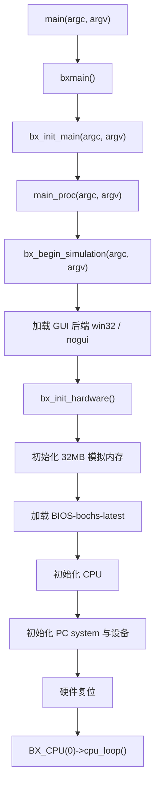

# boch

<div align="center">

一个基于 Bochs 3.0 源码整理、迁移并跑通的 Visual Studio C++ x86 PC 模拟器工程。

从源码、工程配置、BIOS/VGA/硬盘镜像到最终进入客体系统登录界面，这个仓库记录了一段 41 天的移植与调试过程。

`Visual Studio 2022` · `MSVC v143` · `Windows SDK 10.0` · `C/C++` · `x86 Emulator`

</div>

---

## 项目简介

`boch` 是一个以 `E:/Study/codes/bochs-3.0` 为参考源码整理出的 Windows / Visual Studio 工程。它的目标不是从零写一个玩具模拟器，而是把 Bochs 3.0 这套真实、复杂、模块众多的 x86 PC 模拟器源码，逐步迁移到当前的 `boch.sln` 工程中，并让它在本机环境下完整构建、启动、加载 BIOS/VGABIOS/硬盘镜像，最终运行到客体系统登录界面。

当前项目已经完成一个非常关键的阶段性目标：

- `boch.sln` 可以由 Visual Studio 打开和构建。
- `boch` 工程使用 `v143` 平台工具集，目标是 Windows 控制台应用。
- 默认运行路径已经串起内存初始化、BIOS 加载、CPU 初始化、设备初始化和主 CPU 循环。
- 当前硬盘镜像 `hd.img` 已经能够被模拟器加载，并进入客体系统登录界面。

这不是一个简单的“能编译”的仓库。它更像是一次把大型 C/C++ 开源系统拆开、理解、接线、修补并重新跑起来的工程复现。

## 项目亮点

- **完整 Visual Studio 工程化**  
  通过 `boch.sln` 和 `boch/boch.vcxproj` 管理源码，支持 `Debug/Release` 与 `Win32/x64` 配置。

- **基于 Bochs 3.0 的真实模拟器体系**  
  参考源码来自 Bochs 3.0，保留了 CPU、内存、BIOS、VGA、PCI、磁盘、键盘、定时器、中断、调试器、SoftFloat 等核心模块。

- **已打通启动链路**  
  当前主流程从 `main()` 进入 `bxmain()`，再到 `bx_init_main()`、`bx_begin_simulation()`、`bx_init_hardware()`，最后进入 `BX_CPU(0)->cpu_loop()`。

- **资源加载已落地**  
  项目内包含 `BIOS-bochs-latest`、`VGABIOS-lgpl-latest.bin` 和 `hd.img`，当前代码已经把这些资源接入模拟器启动过程。

- **可切换显示后端**  
  默认使用 `win32` GUI，也保留了命令行参数切换：`--nogui` 与 `--win32`。

- **具备继续研究的价值**  
  这个仓库适合继续深入 x86 指令执行、虚拟设备、BIOS 启动流程、硬盘镜像访问、VGA 文本/图形输出和 Windows 平台移植问题。

## 技术栈

| 类别 | 内容 |
| --- | --- |
| 语言 | C / C++ |
| 工程 | Visual Studio Solution |
| 工具集 | MSVC v143 |
| Windows SDK | 10.0 |
| 字符集 | MultiByte |
| 目标类型 | Console Application |
| 主要依赖库 | `ws2_32.lib`, `Comctl32.lib`, `Advapi32.lib` |
| 参考源码 | Bochs 3.0 |

## 目录结构

```text
.
├── boch.sln                       # Visual Studio 解决方案
├── boch/
│   ├── boch.vcxproj               # C/C++ 工程文件
│   ├── boch.vcxproj.filters       # VS 文件筛选器
│   ├── main.cpp                   # 当前工程入口与启动链路
│   ├── config.h                   # 编译配置与 Bochs 功能开关
│   ├── bochs.h                    # 全局声明、宏与核心接口
│   ├── cpu.cc / cpu.h             # CPU 核心
│   ├── fetchdecode*.cc            # 指令抓取与译码
│   ├── myinst.cc                  # 大量指令实现
│   ├── memory.cc / memory-bochs.h # 内存系统
│   ├── harddrv.cc / hdimage.cc    # 硬盘与镜像访问
│   ├── vgacore.cc / vga.cc        # VGA 设备与显示核心
│   ├── keyboard.cc                # 键盘设备
│   ├── pci*.cc                    # PCI / PCI-IDE 相关设备
│   ├── pic.cc / pit.cc / dma.cc   # 中断、定时器、DMA
│   ├── win32.cc / gui.cc          # Win32 显示与 GUI 接口
│   ├── BIOS-bochs-latest          # BIOS 镜像
│   ├── VGABIOS-lgpl-latest.bin    # VGA BIOS 镜像
│   └── hd.img                     # 当前客体系统硬盘镜像
├── x64/Debug/boch.exe             # 本机 Debug 构建输出，属于生成物
├── msbuild-current.log            # 最近一次构建日志
└── msbuild-debug.log              # 调试阶段构建日志
```

说明：当前源码以单个 `boch/` 目录为主，和原始 Bochs 3.0 的多目录组织方式不同。这种结构更贴近 Visual Studio 工程迁移阶段的实际状态。

## 启动流程



当前关键入口在 `boch/main.cpp`：

- `main()`：Windows 控制台入口。
- `bxmain()`：进入 Bochs 主初始化流程。
- `bx_init_main()`：当前简化后的主初始化调度。
- `bx_begin_simulation()`：选择 GUI 后端、初始化硬件并进入 CPU 主循环。
- `bx_init_hardware()`：初始化内存、加载 BIOS、初始化 CPU 和设备。

## 快速开始

### 方式一：Visual Studio

1. 使用 Visual Studio 2022 打开 `boch.sln`。
2. 选择配置：`Debug | x64`。
3. 将 `boch` 设置为启动项目。
4. 执行生成。
5. 启动调试或直接运行生成的 `boch.exe`。

本机当前可执行文件通常位于：

```text
x64/Debug/boch.exe
```

### 方式二：命令行构建

需要先进入带有 MSBuild 环境变量的 Visual Studio Developer Shell，然后执行：

```bat
msbuild boch.sln /p:Configuration=Debug /p:Platform=x64
```

如需构建 Release：

```bat
msbuild boch.sln /p:Configuration=Release /p:Platform=x64
```

## 运行参数

当前 `boch/main.cpp` 支持通过参数选择显示后端：

```bat
boch.exe --win32
```

```bat
boch.exe --nogui
```

默认情况下使用 `win32`。

## 当前硬编码资源路径

当前工程已经跑通，但仍有几个资源路径是本机绝对路径。移动项目目录或换机器运行时，需要重点检查这些位置：

| 文件 | 用途 |
| --- | --- |
| `boch/main.cpp` | 加载 `BIOS-bochs-latest` |
| `boch/vgacore.cc` | 加载 `VGABIOS-lgpl-latest.bin` |
| `boch/harddrv.cc` | 配置 `hd.img` 硬盘镜像 |

当前路径示例：

```text
E:/Study/codes/bochs/boch/boch/BIOS-bochs-latest
E:/Study/codes/bochs/boch/boch/VGABIOS-lgpl-latest.bin
E:/Study/codes/bochs/boch/boch/hd.img
```

后续如果要让仓库更容易迁移，建议把这些绝对路径改成基于可执行文件目录或工程目录的相对路径。

## 构建状态

当前构建日志显示工程已经能够输出可执行文件：

```text
boch.vcxproj -> ...\boch.exe
```

仍然存在一些 MSVC 警告，主要集中在：

- 源文件编码警告，例如 `C4819` / `C4828`。
- 整数类型转换警告，例如 `C4244`。
- 未使用局部变量警告，例如 `C4101`。

这些警告没有阻止当前阶段的构建和运行，但如果后续要长期维护，建议逐步处理：

1. 统一源码编码为 UTF-8。
2. 对 `Bit32u` / `Bit64u` / `bx_address` 之间的转换做显式审查。
3. 删除迁移过程中留下的临时变量和无效代码。

## 开发路线建议

这个项目已经越过了最难的第一座山：它能跑起来。后续可以按照下面的顺序继续打磨。

### 1. 路径配置化

把 BIOS、VGABIOS、硬盘镜像从硬编码绝对路径改成：

- 可执行文件同目录查找；
- 环境变量配置；
- 简单配置文件；
- 或恢复类似 `bochsrc` 的配置能力。

### 2. 清理生成物

当前 `.vs/`、`x64/Debug/`、`boch/x64/Debug/` 等目录里有大量 Visual Studio 生成文件。建议后续补充 `.gitignore`，避免把 `.obj`、`.pdb`、`.ilk`、`.exe`、`.ipch`、`.suo` 等生成物纳入版本管理。

### 3. 编码与警告治理

当前已经通过 `/utf-8` 和部分 warning disable 推动工程构建，但源码里仍有历史编码和类型转换问题。建议按模块逐步处理，不要一次性大范围改动。

### 4. 启动流程文档化

建议继续补充一份更深入的启动链路文档，覆盖：

- BIOS 加载地址；
- CPU reset 后的第一条执行路径；
- 硬盘镜像识别；
- VGA 文本模式输出；
- 从 BIOS 到客体系统启动的关键节点。

### 5. 回归测试方式

由于这是模拟器项目，普通单元测试不一定覆盖核心风险。更实用的验证方式是保留一组可重复的启动场景：

- 能否正常加载 BIOS；
- 能否识别 `hd.img`；
- 能否进入客体系统启动过程；
- 能否稳定到达登录界面；
- 修改设备或 CPU 模块后是否出现回退。

## 与 Bochs 3.0 的关系

参考源码目录：

```text
E:/Study/codes/bochs-3.0
```

原始 Bochs 3.0 README 中说明它是跨平台 IA-32/x86 PC emulator，包含 x86 CPU、常见 I/O 设备和自定义 BIOS 的模拟能力，并以 GNU LGPL 发布。

当前仓库是在该源码基础上的学习、迁移和工程化整理版本。若后续公开发布或分发，请补齐并保留原始项目对应的许可说明，例如 `LICENSE`、`COPYING` 以及必要的版权声明。

## 纪念

这个项目总计耗时 41 天。

41 天里，有环境问题、编译问题、链接问题、编码问题、路径问题、设备初始化问题，也有一次次看似快结束、结果又冒出新错误的时刻。

但最后它跑起来了。

屏幕上出现登录界面的那一刻，这个项目就不再只是几百个 `.cc`、`.c`、`.h` 文件的集合。它变成了一段真实的工程经历：从混乱到可运行，从报错到界面，从“不知道还能不能成”到“它真的起来了”。

这份 README 也是给这个阶段留的一块路标。

## 许可证

本项目参考 Bochs 3.0 源码。Bochs 原项目以 GNU Lesser General Public License 发布。当前仓库如需公开发布，请根据原项目要求补充完整许可证文件和版权说明。
